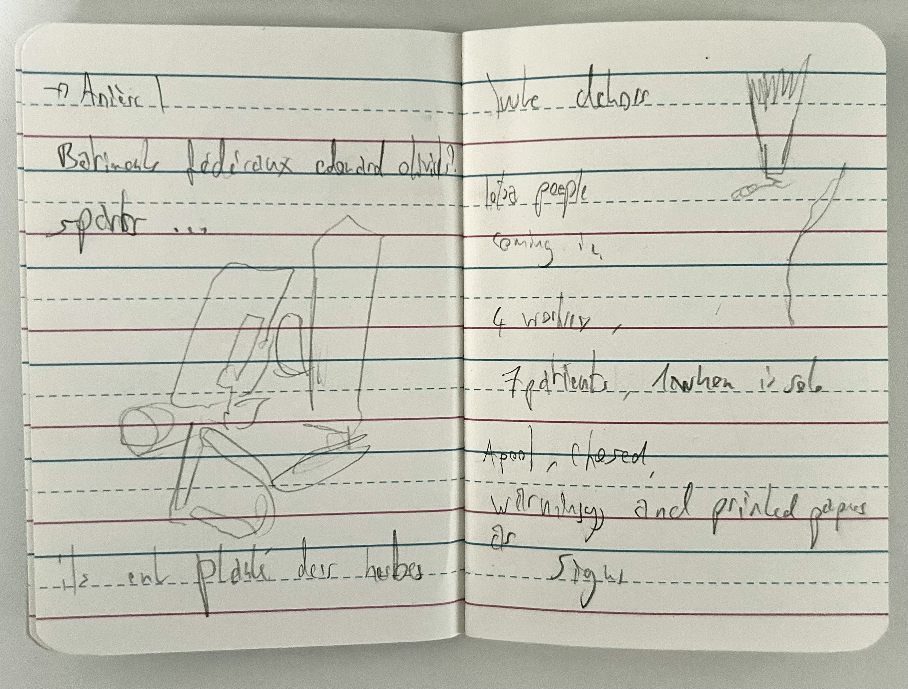
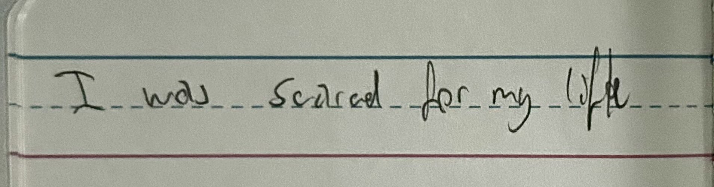
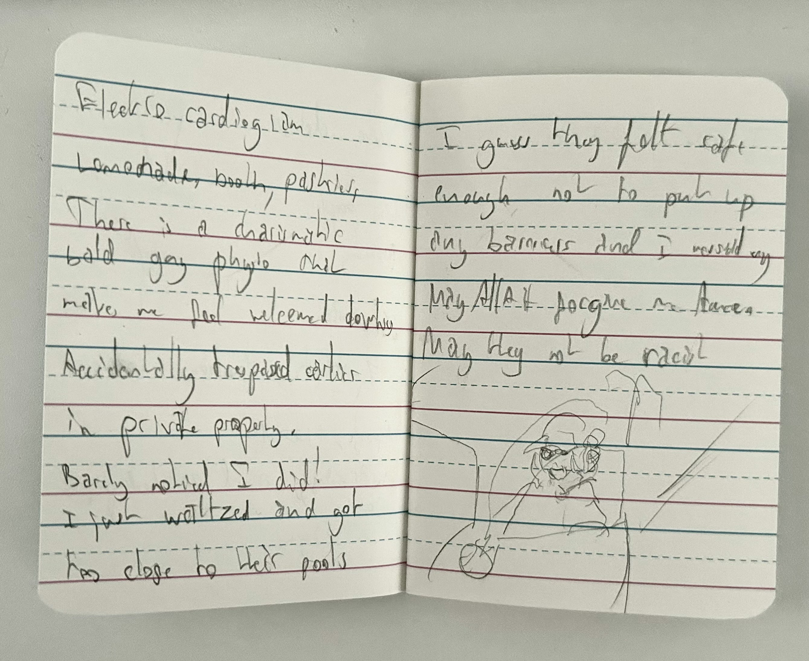
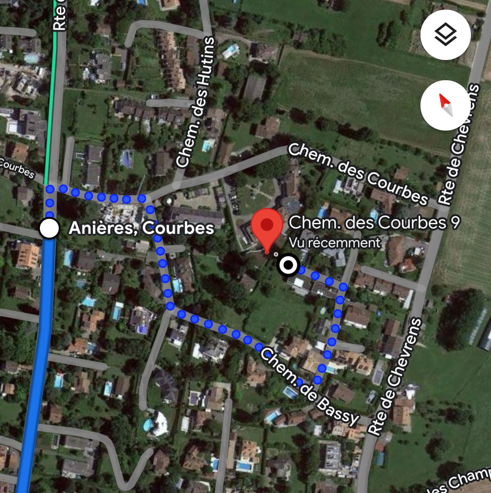
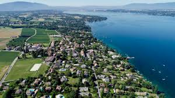
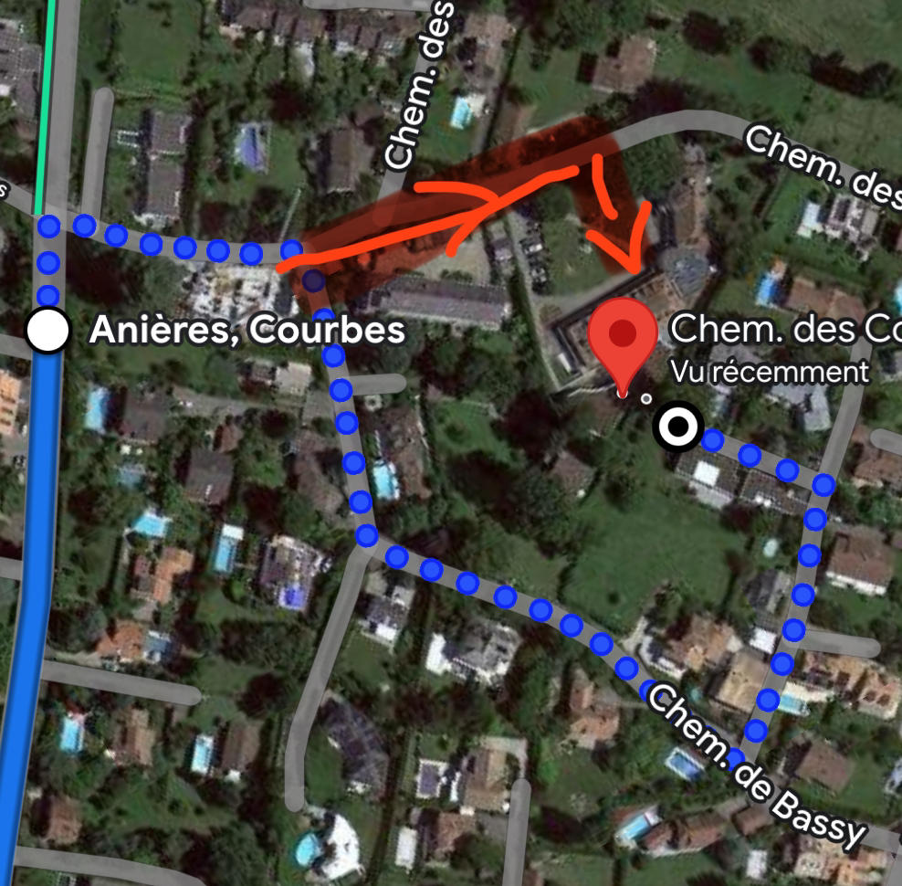

# Research notes 2
 
 	(￣▽￣)ノ

## Physical Observations: Travel to Anière and its community

On monday, I went to visit my mom. She recently got knee surgery. She's fine, but she got moved to Anière for her reeducation. It's a ways away.

<table>
<tr>
<td></td>
<td></td>
<td></td>
</tr>
</table>

Here are my notes on this experience, in the form of messsages I sent to friends after the fact:

> accidentally trespassed in a rich woman's home with a pool **because of google maps.** walked well into their garden and next to their pool

Google maps had given me the wrong path. I confidently walked into this private residential area on accident, looking for my mom. A terrifying experience, and I'm actually surprised Google Maps brought me to a space that was private and wanted me to hop the fence to get to a hospital. Funnily enough, google maps has no care for people's private property.

<table>
<tr>
<td></td>
<td></td>
<td></td>

</tr>
</table>

Come to think of it, isn't it weird everyone's homes is visible from our computers? That used to not be the case. Now, I can see my building's park, my window, and I can walk into a rich person's villa and be guided directly there.

> i was looking for my mom's hospital she was staying at cause they moved her to recuperate better from her knee surgery.

> i saw the pool and thought "huh. a small outside pool. okay. i'm surprised. well. maybe she does exercises in this rich people's pool— okay yeah no that sounds stupid i'm definitely trespassing in someone's property" so i walked back and LO AND BEHOLD the woman who lives there is in her car, sees me walking and stops me to ask me what i was looking for

> and i had to get my earnest behaviour out and she was disgruntled and redirected me but by Allah's will she did not call the cops.
by now I think i need to change my identity and the way I dress

I walked back and left without any issues. I'm actually surprised I didn't get into too many troubles or the cops weren't called. She was disgruntled, but that was to be expected. I was ready to throw myself to the guillotine, honestly.

Otherwise, everyone in Anière was welcoming. It's a place pretty far from central Geneva, so I guess they're a really tightly knit community. Everyone said hi to me with a smile as I passed by them, and they all seemed comfortable. Gardeners, people walking up and down hills, cars... In this place, there weren't that many closed fences too. It seemed like they felt really secure living there, and had no issues between one another. 

**In the face of comfort, people's sense of privacy (or the need for one) eroded to the point where I could simply look into people's homes and enter their private spaces, and walk out without any issues or arguments.**

## As in, comfort erodes the need for privacy.

Passively, not actively I think. Isn't comfort a passive action? Unsure. What even IS privacy, actually...?

The rest of my notes at the hospital were pretty similar. The patients all said hi to me. I walked around without a care in the world and workers said hi to me. I entered through the wrong entrance and it seemed like nobody cared. I assissted my mom during her physiotherapy session, and the guy working there was really eager to welcome me and say hi to me. I asked if it was okay for me to even be there, and he said he didn't care.

I noted a few more things. The 4 workers for 7 patients, the printed warning signs and signals (This is this room, this is that room, don't wear shoes in the pool, etc...) the plants freshly planted right outside the window, the deffibrillator, the bar with pastries and lemonade served... 

Once again, I must reiterate how weird it felt that everyone said hi to me and wasn't that bothered by my presence...? 

