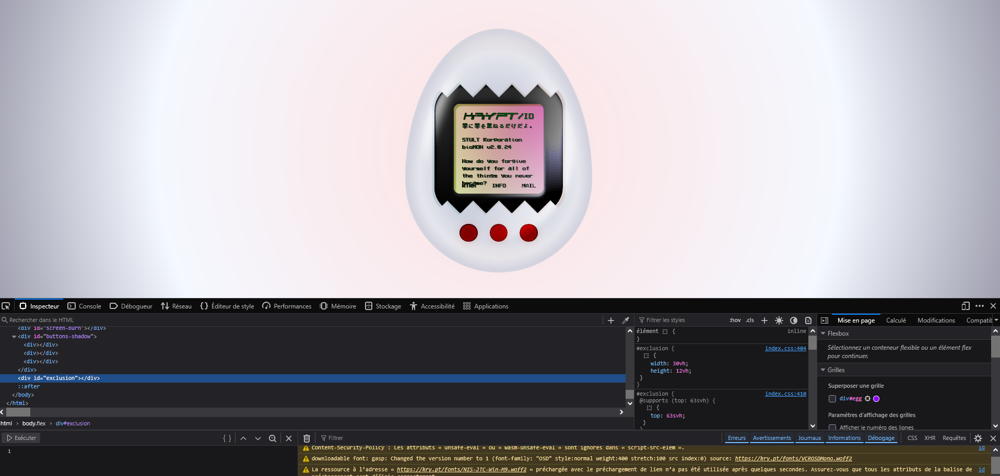
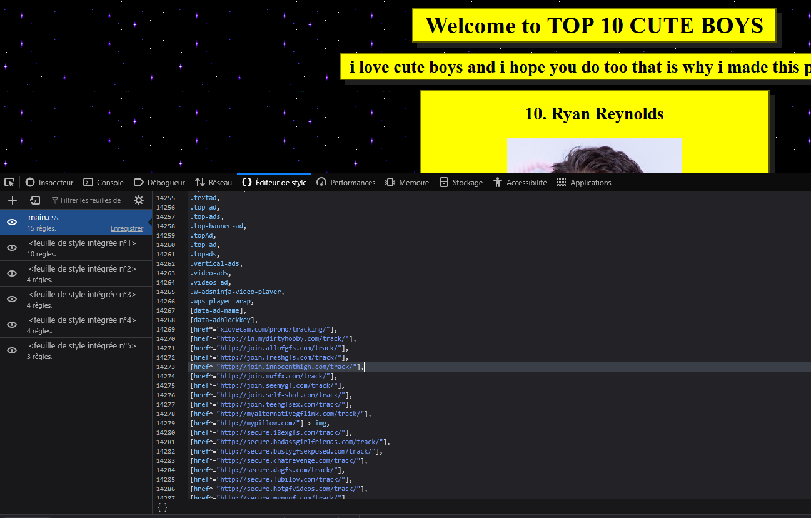

# Research notes 3

## Digital Observations: Travel across the web

If I can observe the world physically, then what about digitally. 

In comes my research of the internet's most remote corners.

### Digital Footprints (1-18)

<table>
<tr>
<td></td>
<td></td>
<td></td>
<td></td>
</tr>
<tr>
<td></td>
<td></td>
<td></td>
<td></td>
</tr>
<tr>
<td></td>
<td></td>
<td></td>
<td></td>
</tr>
<tr>
<td></td>
<td></td>
<td></td>
<td></td>
</tr>
<tr>
<td></td>
<td></td>
</tr>
</table>

### Platform Comparisons

<table>
<tr>
<td></td>
<td></td>
<td></td>
</tr>
</table>

(Digital footprint)

Notes from Joël Vacheron about the research: 

> "Idiosyncracies [...]
We talk about the first programs. They were always marked by the singularity or the identity of programmers. Something always linked of the identity of those that produce it- Idiosyncracies."
