# Research notes 3

## Digital Observations: Travel across the web

If I can observe the world physically, then what about digitally? 

In comes my research of the internet's most remote corners.
My method to look into digital spaces was mostly to look into lost or hidden websites online. We're gonna be looking at forums, old wesbites, neocities websites, portfolios...
Then, I would press F12 on all those pages to check the console, CSS codes, HTML, to see if I could see hidden messages in the code. 

But why Neocities? Why the interest in it?
In recent months, due to the advent of fascism in the United States, and more recent issues regarding privacy online, people have decided to move more self-controlled spaces.
<table>
<tr>
<td>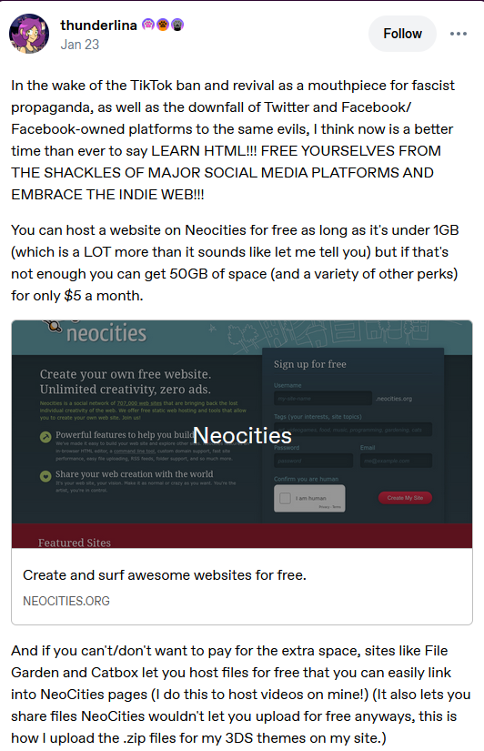</td>
</tr>
</table>

 Source from [Thunderlina on Tumblr.com](https://www.tumblr.com/thunderlina/773499778884665344/neocities)

People have decided to take control of their own online free real estate. I thought it was interesting. Recent politics have made it so that people distrust the internet, a sort of stance against the developments of late-stage capitalism. Instead of companies running the internet and imposing rules, users have their own space they can control and govern to an extent.

Here is a screenshot containing comments:
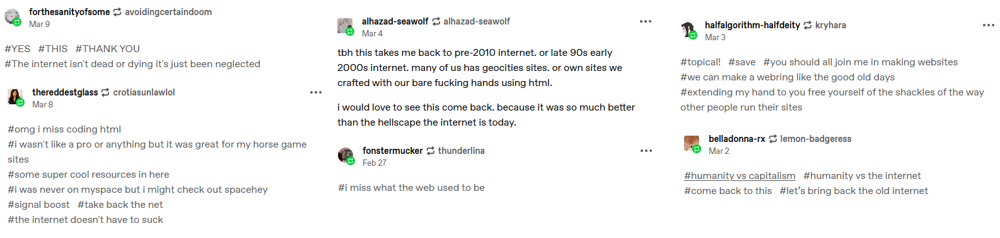

Not many varying stances. They all share the same frustration and interest towards this post, naturally.
___

# [- Kry.pt](https://kry.pt/)

<table>
<tr>
<td>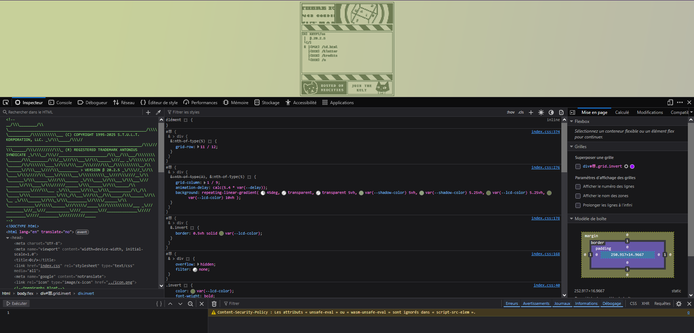</td>
<td></td>
<td>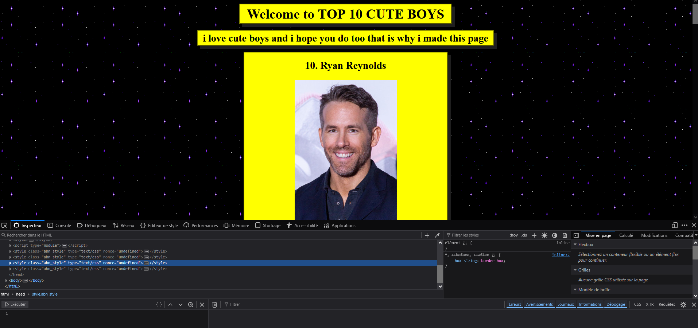</td>
</tr>
</table>

This website was really impressive. People create their own portfolio websites this way, or quirky sites to show off their coding skills. This one was particularly impressive. Looking into it, and clicking on their manifesto link, led me straight towards a list of top 10 cute boys, formatted in kitschy old style. I thought it was funny. The list ended with me being the number 1 cutest boy. I'm most delighted.

Looking into their code was really fun. For example, I found this.
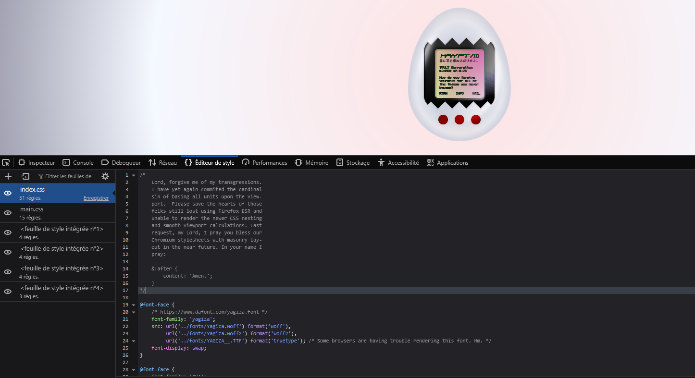

Their CSS reads this comment:

> /*
    Lord, forgive me of my transgressions. 
    I have yet again commited the cardinal 
    sin of basing all units upon the view-
    port.  Please save the hearts of those
    folks still lost using Firefox ESR and
    unable to render the newer CSS nesting
    and smooth viewport calculations. Last
    request, my Lord, I pray you bless our
    Chromium stylesheets with masonry lay-
    out in the near future. In your name I
    pray:

>    &:after { $

>        content: 'Amen.'; 
>    }
>*/

Comments in code hold a lot of fun jokes like that. I had almost forgotten about that trend and habit.

### - More comments in Kry.pt

<table>
<tr>
<td>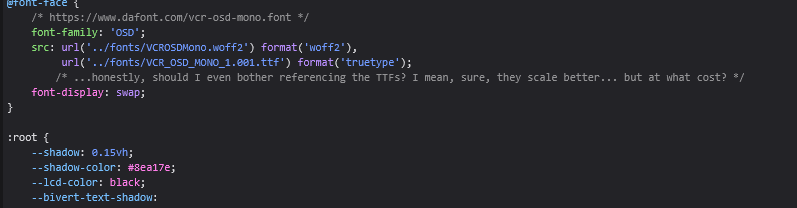</td>
<td>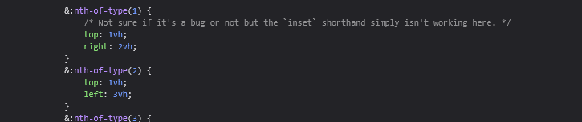</td>
</tr>
</table>

>   /* ...honestly, should I even bother referencing the TTFs? I mean, sure, they scale better... but at what cost? */

> */ Not sure if it's a bug or not but the `inset` shorthand simply isn't working here */ 

Comments like these are really fun to discover. They really give an insight into who the programmers are. It really gives artistry, personallity and love to the ins and outs of coding. I miss this era of the internet, where I could see bits of people shine through the online world. The web used to feel alive.

# [- Dokode.moe and more disclaimers](https://dokode.moe/indexv3)

<table>
<tr>
<td>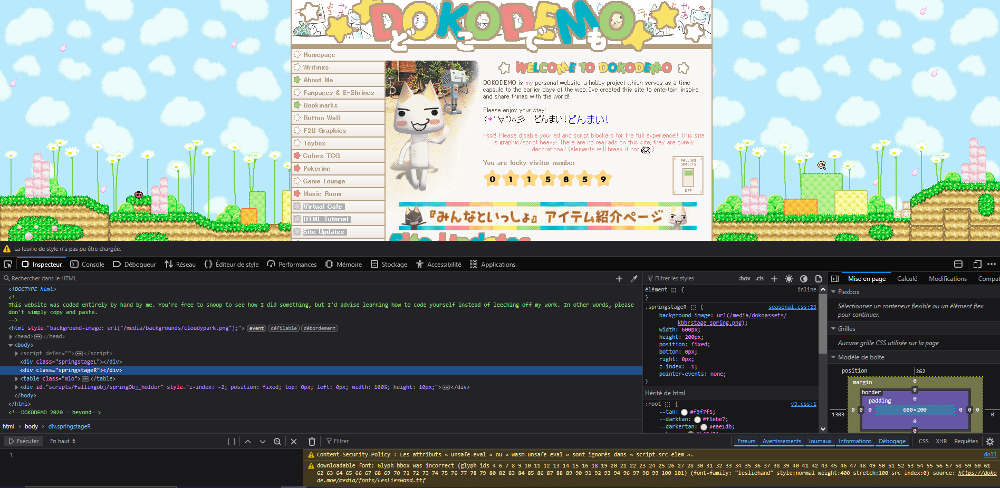</td>
<td>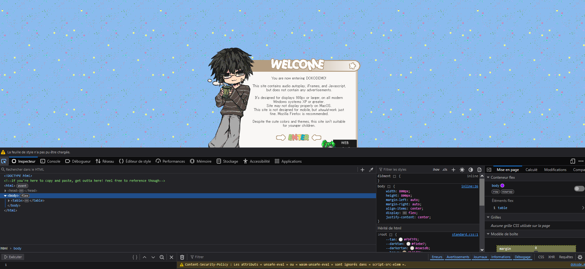</td>
</tr>
</table>

People leave disclaimers at the start of their HTML codes, warning people not to copy their codes. Their work, their property, their own bits of their soul laid out for others to see.

# [- Velvet Blue](https://velvetblue.neocities.org/)

<table>
<tr>
<td>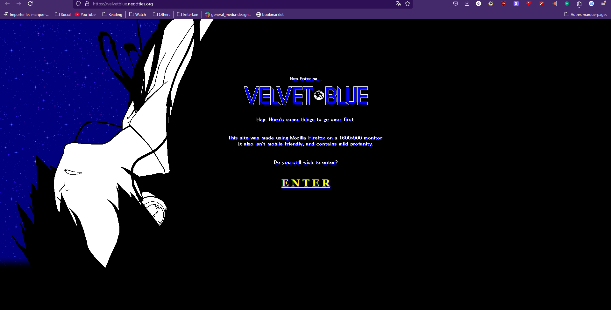</td>
<td>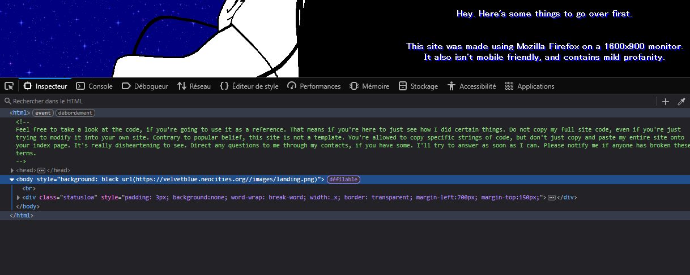</td>
<td>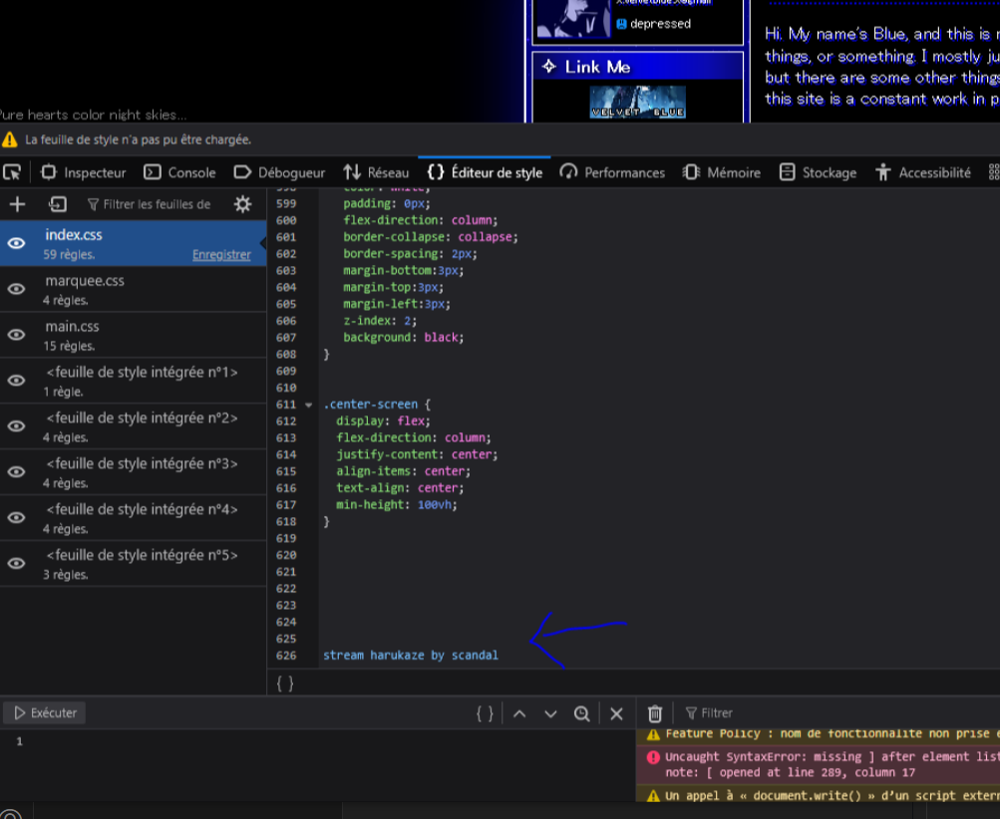</td>
</tr>
</table>

This one is a blink and you'll miss it moment. At the bottom of their css file, they wrote:
> stream harukaze by scandal

Parts of people will shine through, always.

# [- Speaking of streaming...](https://scaruffi.com/)

<table>
<tr>
<td>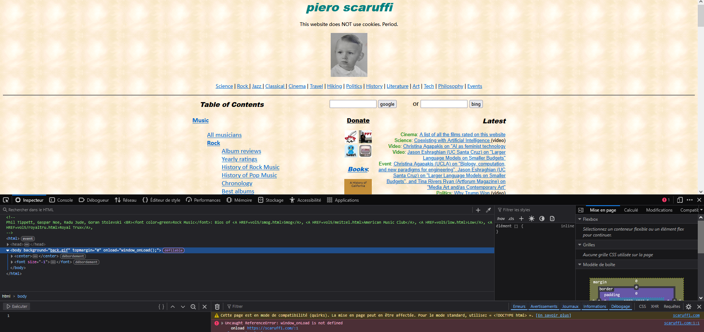</td>
</tr>
</table>

This is an old discontinued website called Scaruffi.com. It mainly prides itself innits musical content, from jazz to rock to more. I didn't look too deep into it, but the HTML code holds the name of the owners of the website, if I'm not mistaken.

## Old forums are also a neglected social relic.

<table>
<tr>
<td>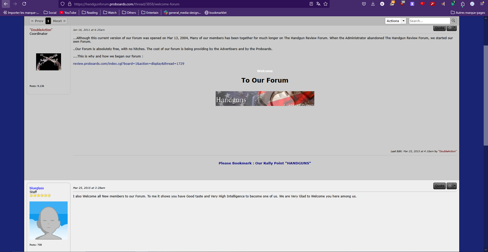</td>
<td>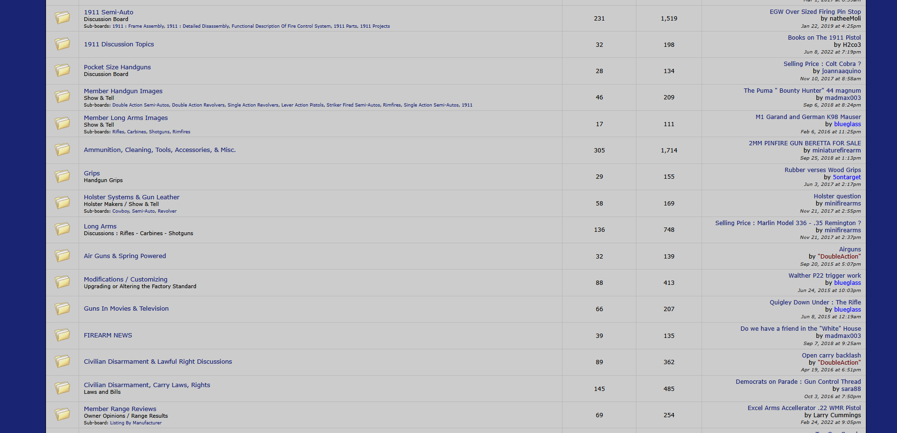</td>
<td></td>
</tr>
</table>

This is the [first old forum](https://handgunforum.proboards.com/thread/3858/welcome-forum) I came across, which stopped having activity since 2017, but [received the activity from a bot in 2022.](https://handgunforum.proboards.com/thread/5266/ng-ch-w88?page=1&scrollTo=26352)

## [- Yet another forgotten website](https://members.tripod.com/m_reader/main_faq.html).

<table>
<tr>
<td>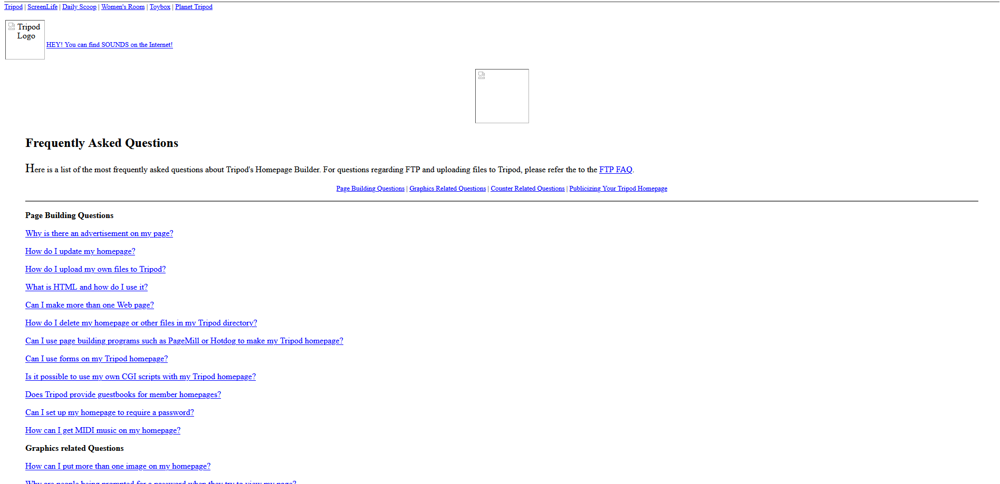</td>
</tr>
</table>

A bit more discontinued than the rest, this website is an artefact of perhaps broken links and images. I dig it. I like this aesthetic. I wonder what it used to look like before the code started falling apart. It seemed to be a place about building your own website and community, teaching people HTML...

## Now, onto Social Media Platforms...

<table>
<tr>
<td>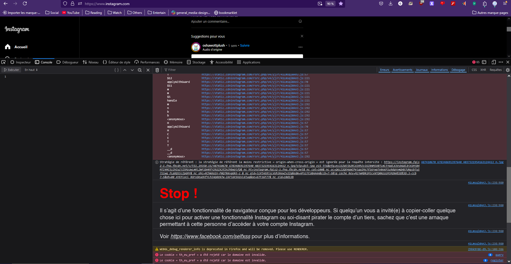</td>
<td>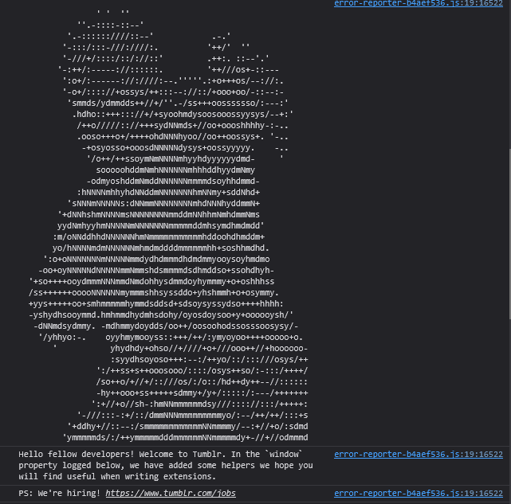</td>
<td>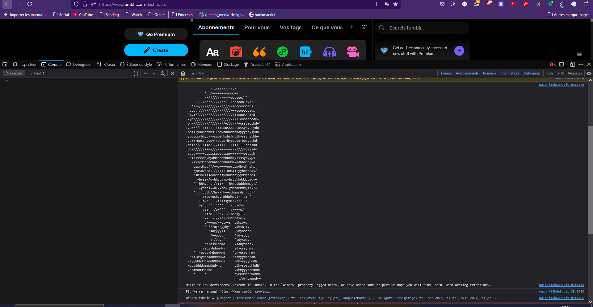</td>
</tr>
</table>

Some websites hold hidden messages in their consoles. Instagram shares a warning message

>  Stop ! 

> Il s'agit d'une fonctionnalité de navigateur conçue pour les développeurs. Si quelqu'un vous a invité(e) à copier-coller quelque chose ici pour activer une fonctionnalité Instagram ou soi-disant pirater le compte d'un tiers, sachez que c'est une arnaque permettant à cette personne d'accéder à votre compte Instagram. 

> Voir https://www.facebook.com/selfxss pour plus d'informations. 

They laid out clear warning for users to not fall for scams online. Tumblr, on the other hand, holds no fear for its own userbase, and in fact shows interest in them. If they opened the console, they must be qualified coders. (...) (And they top it up with some ASCII art of potato Steve Harvey, and Guy Fieri in his iconic pose)

> Hello fellow developers! Welcome to Tumblr. In the `window` property logged below, we have added some helpers we hope you will find useful when writing extensions. 

> PS: We're hiring! https://www.tumblr.com/jobs

---

# Final observations

There is a trend of building private spaces on the internet, where you control what you host and where you host it. 
Incidentally, it is also telling to notice the comparisons between physical and digital spaces, and draw conclusions.

Here are some notes from Joël Vacheron about the research: 

> "Idiosyncracies [...]
We talk about the first programs. They were always marked by the singularity or the identity of programmers. Something always linked of the identity of those that produce it- Idiosyncracies."

There is a link between users and what they produce, and interact with. Those identities disappear as social media spaces erode users' privacy or create a form of social hegemomny with strict rules and guidelines and forms to follow.

Users have no places to breathe online, so they create their own and go wild. Whereas, in more communal spaces, where comfort reigned, that aspect seemed a bit more tame. 
Or perhaps my perception of things is wrong...?

## NOTES: 

- The "death" of personal websites led to a renaissance of DIY web culture

- personal sites → social media → back to personal sites

- code itself becomes a medium for personal expression and resistance

- digital comfort VS control (more comfort = less control)