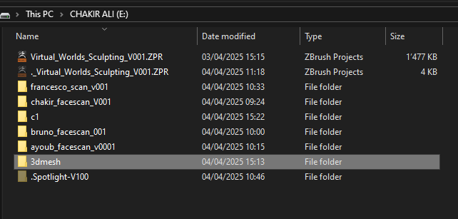
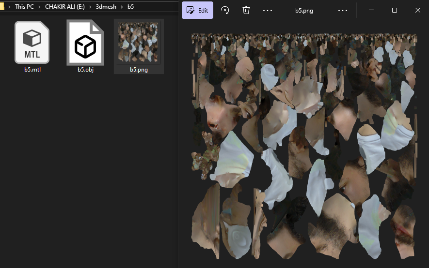
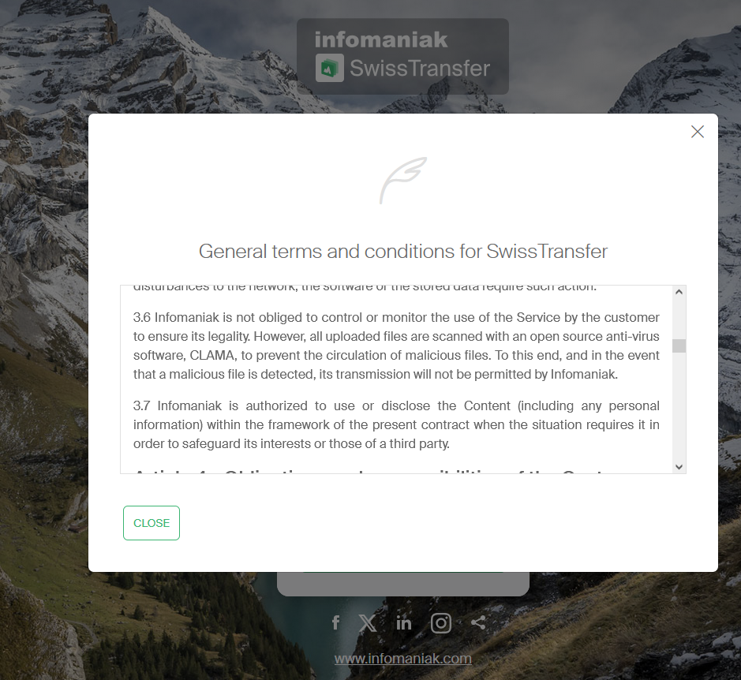
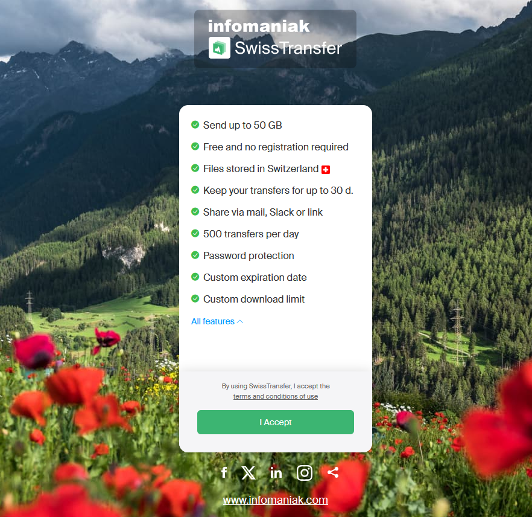
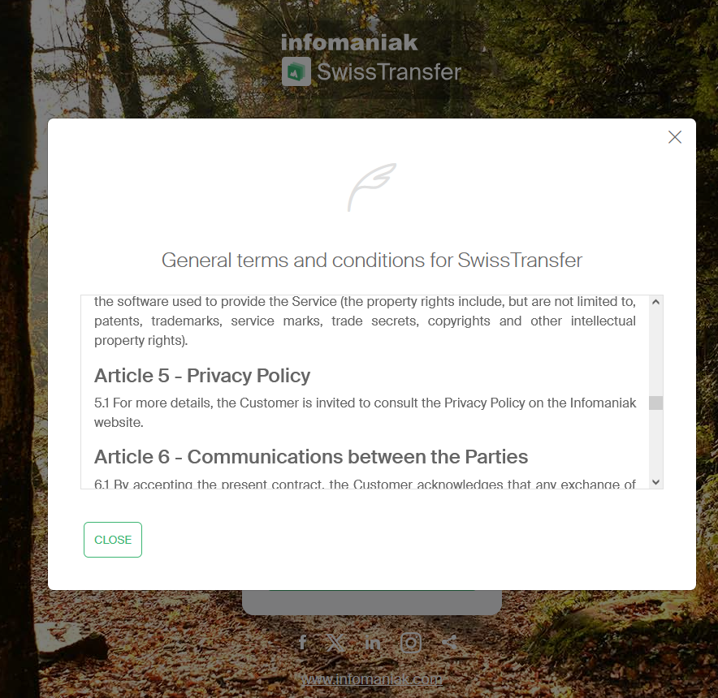
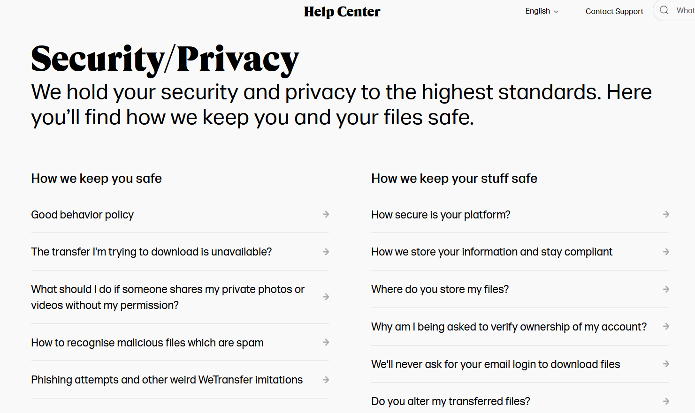
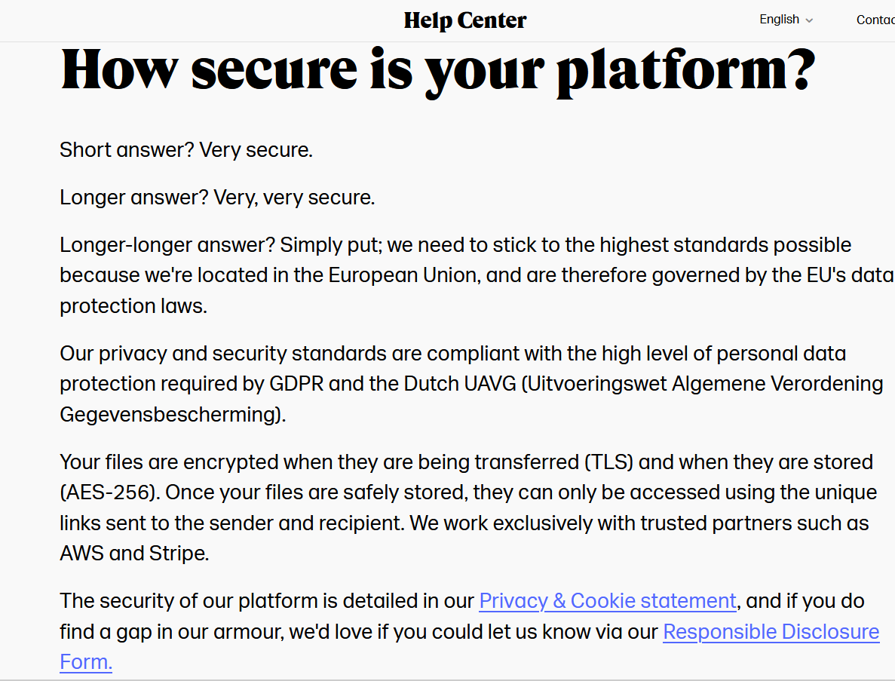
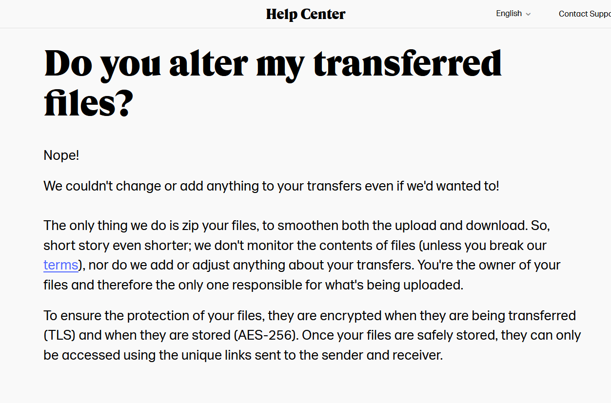
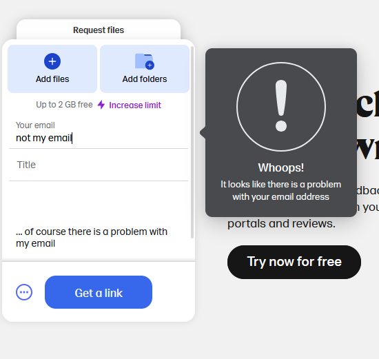

# Thoughts (2025-04-04)

 	ʕ⁎̯͡⁎ʔ༄  tough crowd today

We're working on a Zbrush project, for now, and doing face scans.
The only thing of note that happened today was this.

During the face scans, I'd provide people my hard drive to transfer the data from the scanning computer to their own devices.

Essentially, doing so, I'd also get access to everyone's face data.
In fact, I actually did get to go home with this.

My classmate, Ayoub Azzouzi, noted how ironic it was that I got to "steal" everyone's face, their likeness and private property, only by providing this service to them. How ironic it was that I work on privacy, and encroached upon theirs just like that.
Agency isn’t about intent. I didn’t steal; the system we had in place handed me power because I “offered help.” 
That’s how convenience reverses the direction of consent.

Similarly, just this week, I had tried to transfer data from my phone to another hard drive, but the transfer of huge files took too much time. 
I tried using WeTransfer, but it only allowed ip to 2 Go.
Swisstransfer, however, allows up to 50Go. I was amazed! I ran to it, then halfway through, I stoped my transfer.

*...50 Go, for free?...*

I checked the terms and services and more.

Swiss transfer has no end-to-end encryption*, meaning they have entire access to the data transferred through them.

<table>
<tr>
<td></td>
<td></td>
<td></td>
</tr>
</table>

> No mention of ToS, and also, to see the privacy policy, I have to find their website (Infomaniak), get out of swisstransfer also, then find their privacy policy, then find the place where they talk about privacy policy vis-à-vis the files that get transferred through them. (I did not find anything.) That inconvenience is really out of place. The entire ToS is written there, but the privacy policy is the only one that prompts me to LEAVE the website to read it???? And then go HUNTING AND GATHERING to find it?!?!??!!? Also, there's no mention of End-to-End Encryption, by the way. Couldn't find anything.

Isn't it great! A service as good as this... and here we are, still encroaching on my privacy just for the sake of convenience. 

Convenience is a great tool, design-wise, to steal people's privacy. I'm guessing this isn't new info. 

Stopping my transfer was a good call. 
Investigating SwissTransfer before fully committing is something I almost never did, prior to this research. Resisting "frictionless" design when it smells like surveillance... Is that what a minimal amount of critical UX literacy looks like? Meh. I'm stupider than I had thought.

 “privacy is taken" --> Nope, and you definitely are going to agree with my following statement. We give it away, willingly, and comfortably. Design makes us feel like we have no reason not to. (The role of the designer in data protection...)

By the way, WeTransfer confirms they use End-To-End Encryption on your files. The bare minimum, btw.

<table>
<tr>
<td></td>
<td></td>
</tr>
</table>

