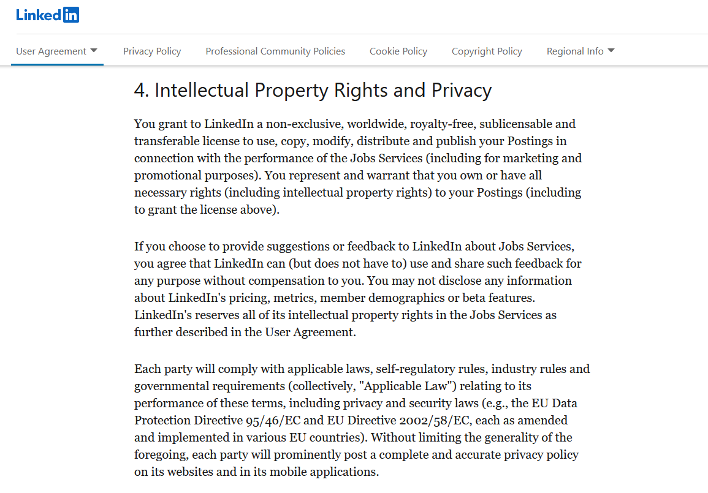
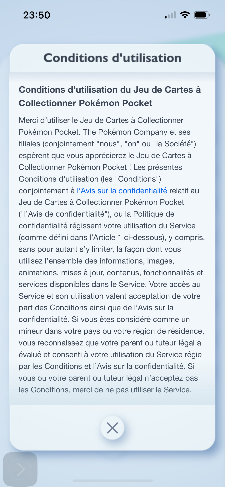
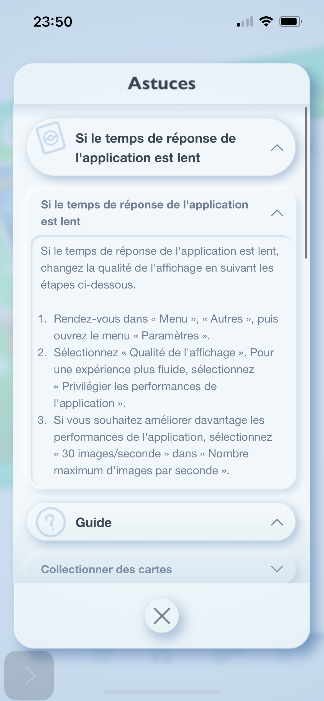
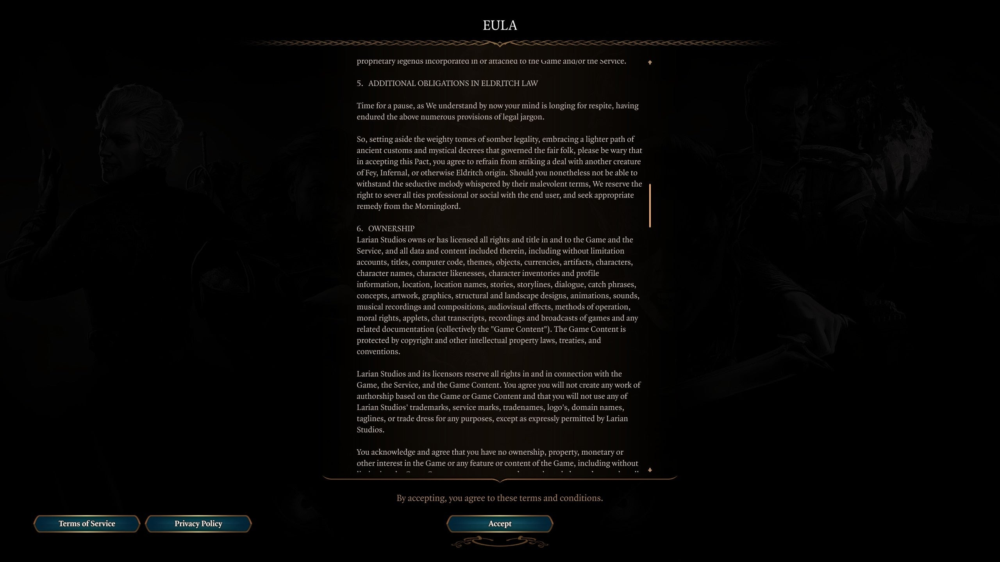

# Thoughts (2025-04-05)

 	( ✌︎'ω')✌︎ weekend!

Observing the references I found. 

Reflections on terms and services for example. Not exactly sure this would actually yield any insight, actually.

Here are the terms and services from Linkedin.

> 3. Intellectual Property

> 3.1    License. You grant to LinkedIn (and its affiliates) a non-exclusive, worldwide, royalty-free, sublicensable and transferable license to use, copy, modify, distribute and publish any content You provide to LinkedIn. The foregoing license survives termination of this Contract with regard to content provided prior to termination. 

I find that impressive, and linked to my point in previous documents.

"If it's on the web, it's accessible." Proprietary rights erode and disappear, while users participate in platforms meant to **aid** in their careers or social interactions. 
But that's not design. That's terms and services. What's really compelling is **how** and **why** people agree to those things.

The services of Linkedin become indispensable by design due to how its community and the usage of this platforms aids in people's careers. It becomes an *indispensable piece of social media*. Too many times, people tell me I need to keep my Linkedin up to date. How many of those users read those terms and services? About none of them, I'd almost wager.

Incidentally, the way terms and conditions are designed is also deliberate. *Thin font, capital letters, with the drapeau being too squared, tight, cluttered;* **type like this becomes more like a texture than a text worth reading.**

The readability of it all is no different than ready a block of Lorem Ipsum. 

## Actually, this makes me think about how deliberate it is.

Terms and Services pages are always designed in such a way that makes the page look "legally official".

 Getting on Nintendo platforms or The Pokemon company's and looking at their terms and services page — you'd immediately notice their pages is distinctly different design-wise, from all their other User Interfaces. Do they do this for readability? I certainly believe that is the case. The text-formatting is dull and simple, hard to read as well. That is a deliberate design choice. They don't want users to enjoy reading this. The text has long-winded sentences, with jargon that is hard to understand for clients. 

Here's Pokemon TCGP's TOS compared to its "Astuce" section, meant to aid in gameplay and stuff.

<table>
<tr>
<td></td>
<td></td>
</tr>
</table>

Here's also [Baldur's Gate 3's End User License Agreement](https://store.steampowered.com/eula/1086940_eula_0), the one legal page in recent years that I actually enjoyed reading, as well as many other users. Why? Because it was designed and written in a way that was a bit more whimsical and fun.

*they also designed it to fit in the UI of the game!*

> Hello and welcome, mortal soul.

>So you wish to embark on an adventure in the Forgotten Realms...

>We know you've already given up some coin to get this far, and for that of course we're grateful. Yet you must also know that every deal with a being such as ourselves comes with additional terms and conditions. Let us lay them out for you.

The entire EULA is written like this, whcih is pretty fun. That means it's possible to make Terms and Conditions legible, and entertaining to read. 
Meaning, any other TOS that are not readable are made to be illegible deliberately.

> *Your favourite designers design discomfort. (The graphic design of coercion)*

> **Your favourite designers designed your terms and conditions page to be illegible.**

___

[...]

Design creates an illusion of safety, simplicity, and helpfulness. It does so by neatly hiding the mechanisms people **should** be made aware of.

I'm thinking also about how the debate of "privacy" always centers around the topic of security, but people have more a reaction to those statements. (AGAIN. WHAT *IS* PRIVACY? I DON'T DEFINE IT ONCE.)

But like, who cares if I write about this? "Oh no they're stealing our data". 

Who cares? Nobody cares. Nobody has started to care. There's no reaction to privacy being stolen, when it's covenient. 

I want to talk about WHY and HOW we just accept it. And the answer is really linked to design and convenience. i.e. 
Manufactured COMFOOOOOORT! :o)
